<div align="center">


[](https://github.com/RajTewari01/galaxy-qr-generator/actions/workflows/build.yml)
[](https://github.com/RajTewari01/galaxy-qr-generator/actions/workflows/codeql.yml)
[](https://python.org)
[](https://pypi.org/project/PyQt5/)
[](LICENSE)
[](https://github.com/RajTewari01/galaxy-qr-generator/releases)

[](https://github.com/RajTewari01/galaxy-qr-generator/stargazers)
[](https://github.com/RajTewari01/galaxy-qr-generator/network/members)
[](https://github.com/RajTewari01/galaxy-qr-generator/commits/main)
[](https://github.com/RajTewari01/galaxy-qr-generator)
[](https://github.com/RajTewari01/galaxy-qr-generator/issues)

<br/><br/>


**A fully offline desktop QR code generator with gradient styling, rounded modules, and 10 hand-crafted UI themes.**

[📖 Wiki](https://github.com/RajTewari01/galaxy-qr-generator/wiki) · [🐛 Report Bug](https://github.com/RajTewari01/galaxy-qr-generator/issues/new?template=bug_report.yml) · [✨ Request Feature](https://github.com/RajTewari01/galaxy-qr-generator/issues/new?template=feature_request.yml) · [📦 Releases](https://github.com/RajTewari01/galaxy-qr-generator/releases)

</div>

---

## 🧠 Why Galaxy QR Core?

The majority of modern QR generators rely entirely on web ecosystems, SaaS API calls, or ad-supported interfaces. This creates intrinsic privacy risks, forces network dependency, and heavily restricts visual customization.

Galaxy QR Core was engineered to completely invert that model:

- **Air-gapped Execution:** Operates entirely offline, guaranteeing zero-telemetry and absolute data privacy for sensitive payloads (like WiFi credentials or payments).
- **Native Rendering Engine:** Bypasses basic pixel grids to algorithmically compute sub-pixel gradients and rounded modules using `qrcode[pil]`.
- **Zero-Dependency Footprint:** Compiled into standalone binaries, delivering raw native application performance without requiring users to install Python or frameworks.

---

## ⚡ Performance Validation

This application is strictly optimized to execute seamlessly on low-tier, non-GPU accelerated hardware.

**Benchmark Environment:** 4-Core CPU, 4GB RAM, Integrated Graphics

| Subsystem | Latency Metric | Context Constraints |
| :--- | :--- | :--- |
| **QR Generation Engine** | `~50 – 120 ms` | Scales linearly with payload size & gradient complexity |
| **Theme Injection** | `~10 ms` | Handled natively by PyQt5 StyleSheet evaluation |
| **System Cold Boot** | `~0.8 – 1.5 sec` | Bound by OS-level IO extraction (PyInstaller setup) |

---

## 🆚 Comparison Table

| Feature Matrix | Galaxy QR Core | Ad-Supported Web Generators | Traditional CLI Tools |
| :--- | :---: | :---: | :---: |
| **Runtime Environment** | Native Desktop | Web Browser | Terminal |
| **Network Independent** | ✅ | ❌ | ✅ |
| **Data Privacy** | Absolute | Compromised | Absolute |
| **Algorithmic Gradients** | ✅ | ⚠️ Premium Only | ❌ |

---

## 📸 Interface Preview & Themes

<div align="center">
  <table>
    <tr>
      <td width="50%">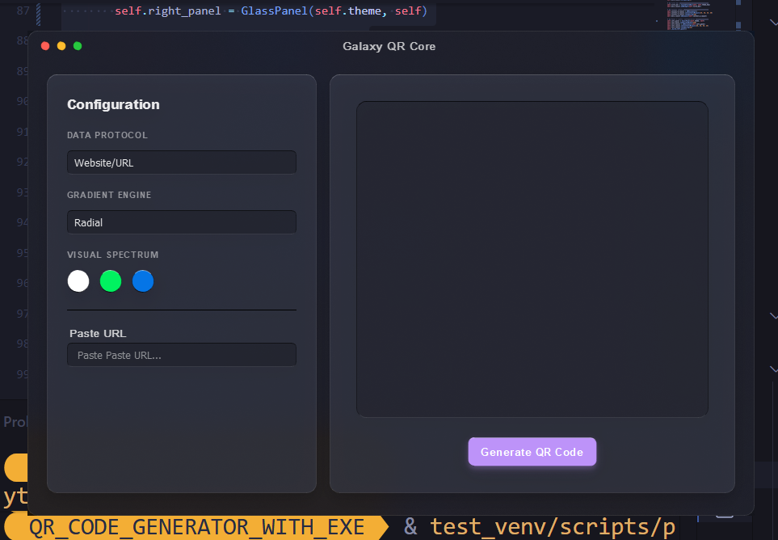</td>
      <td width="50%">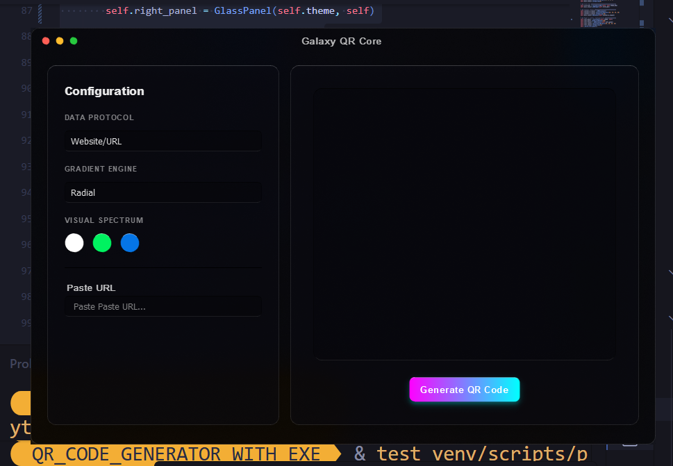</td>
    </tr>
    <tr>
      <td>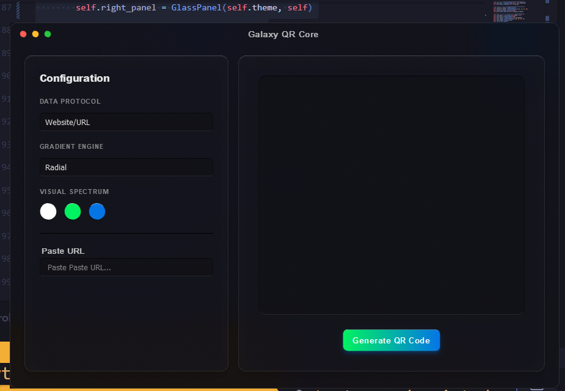</td>
      <td>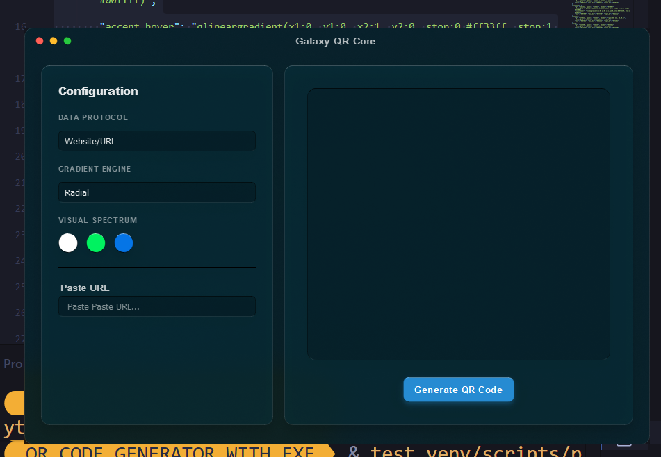</td>
    </tr>
    <tr>
      <td>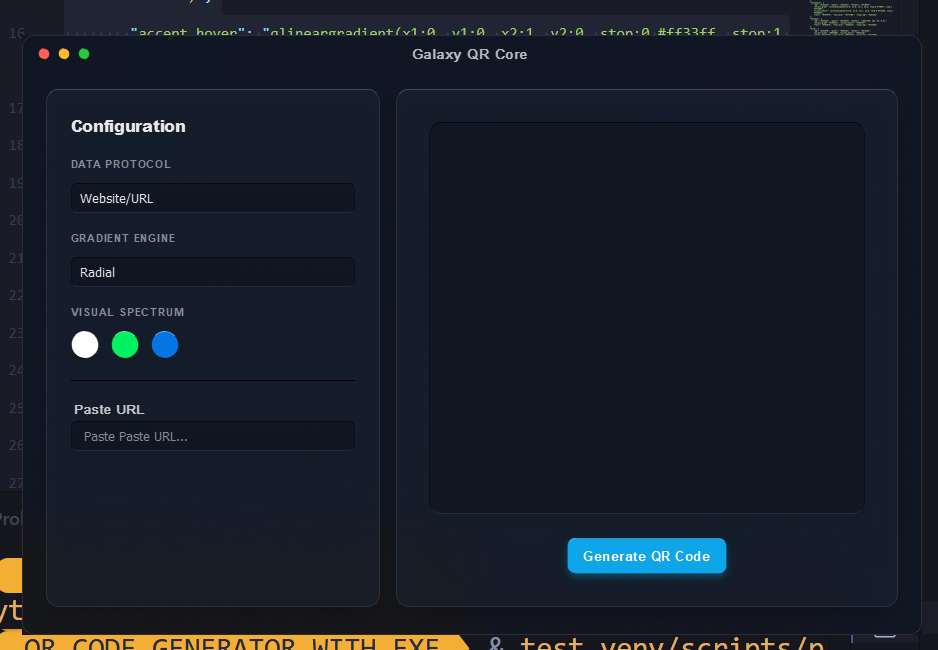</td>
      <td>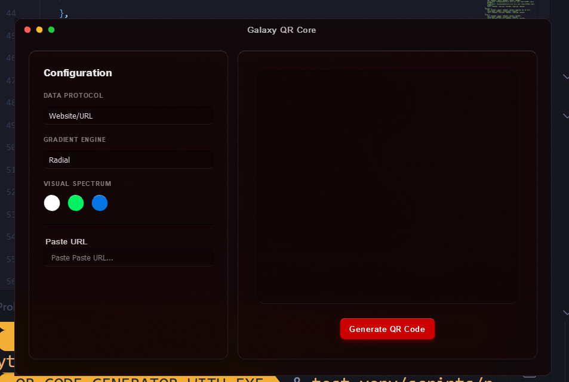</td>
    </tr>
    <tr>
      <td>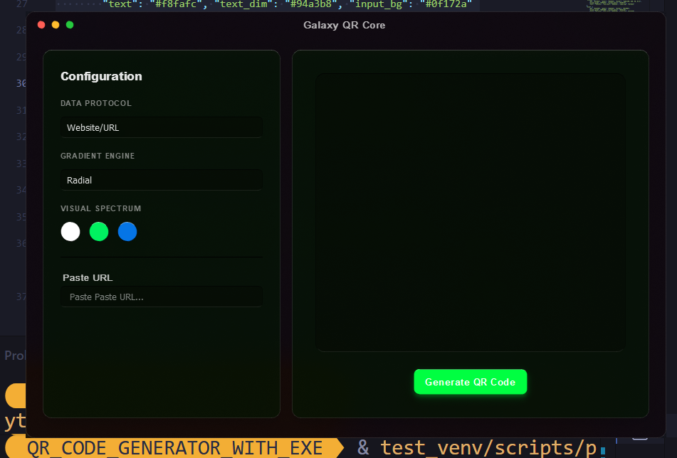</td>
      <td>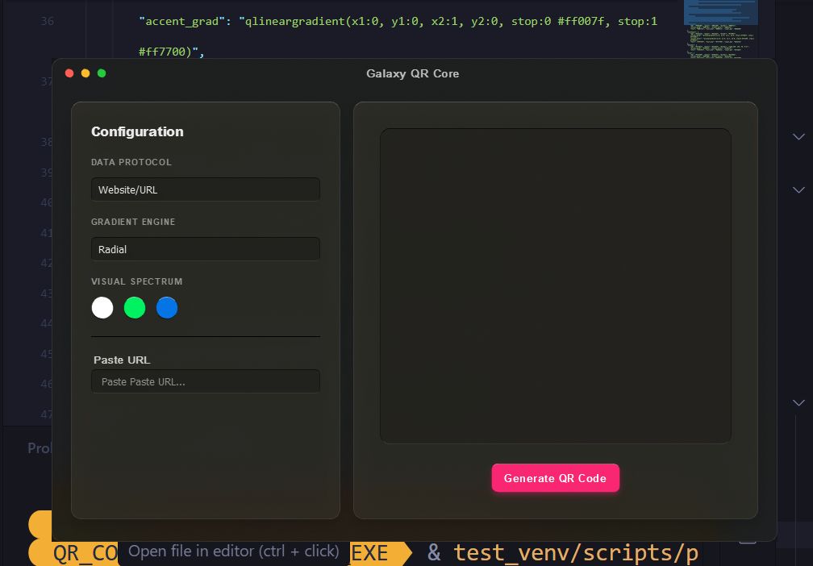</td>
    </tr>
    <tr>
      <td>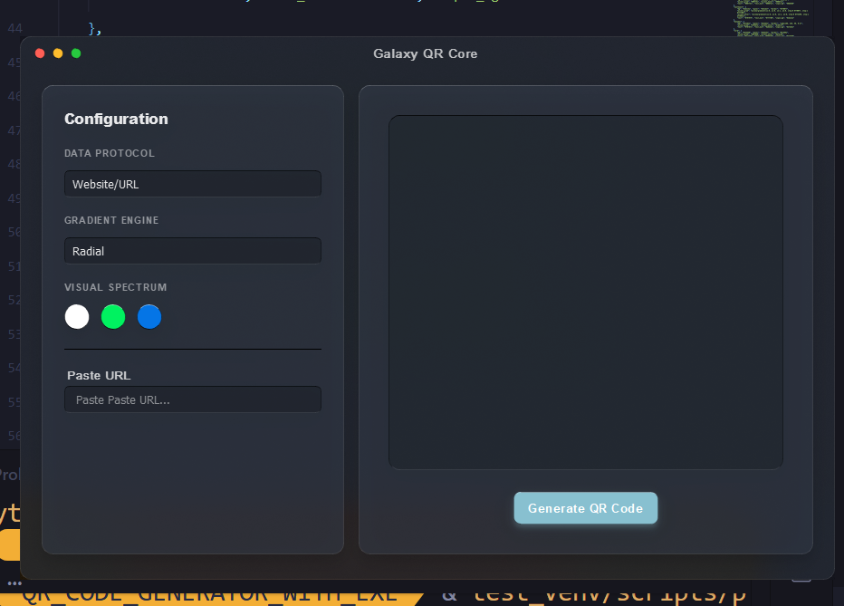</td>
      <td>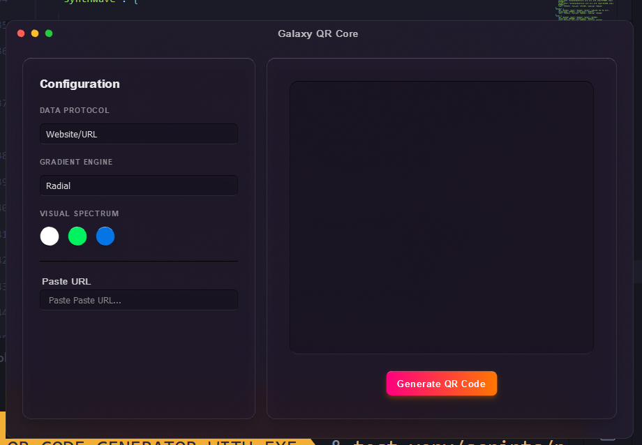</td>
    </tr>
  </table>
  <br/>
  <em>Fully interactive Apple "Glassmorphism" design engine natively powered by PyQt5, adapting seamlessly to 10 unique themes.</em>
</div>

---

## ✨ Key Features

<table>
<tr>
<td width="50%">

### 🎨 10 Curated Themes

Switch between Apple Dark, Dracula, Neon Cyber, Solarized, Ocean, Matrix, Synthwave, Monokai, Nord, and Crimson — all hand-crafted with matching accent gradients.

</td>
<td width="50%">

### 🔌 10 Data Protocols

Generate QR codes for URLs, Wi-Fi, vCards, SMS, Email, WhatsApp, YouTube, UPI payments, plain text, and geo-coordinates.

</td>
</tr>
<tr>
<td width="50%">

### 🌈 4 Gradient Types

Apply Radial, Vertical, Horizontal, or Square gradient masks to your QR modules with full color customization.

</td>
<td width="50%">

### 📡 100% Offline

Zero network calls. No telemetry. No tracking. Everything runs locally on your machine.

</td>
</tr>
<tr>
<td width="50%">

### 🖥️ Cross-Platform

Runs natively on Windows, macOS, and Linux. Pre-built executables available via [Releases](https://github.com/RajTewari01/galaxy-qr-generator/releases).

</td>
<td width="50%">

### ⚡ Single Binary

PyInstaller bundles everything into a standalone executable — no Python installation required for end users.

</td>
</tr>
</table>

---

## 💼 Practical Use Cases

This architecture natively supports distinct offline workflows:

- **Developers & QA:** Safely generating encoded testing payloads for deep-links and local subnets without triggering external network firewalls.
- **Graphic Design Pipeline:** Instantly applying specific hex-code gradients and generating aesthetic reference codes.
- **Physical Retailers:** Managing strict Wi-Fi routing and secure Point-of-Sale checkout protocols independently of third-party web services.
- **Privacy Advocates:** Providing absolute cryptographic isolation when converting sensitive personal contact information into vCard formats.

---

## 🧱 Design Principles

The internal architecture strictly enforces modular separation and configuration-driven logic:

- **Aggressive Modularity:** Dedicated single-responsibility modules (`ui_components.py` vs `engine.py`) isolate calculation logic from presentation layers.
- **Engine/UI Disassociation:** The core image generation algorithm operates blind to the PyQt5 interface, ensuring maximum reusability.
- **Configuration-Driven Thematics:** All colors, gradients, and accent tokens are extracted from runtime dictionaries, eliminating hardcoded style properties.
- **Offline-First Constraint:** External API dependencies are entirely prohibited at runtime.

---

## 🏗️ Architecture

The codebase is structured as a layered pipeline. Each module owns a single concern.

```text
src/
├── main.py            # Entrypoint — CLI args, QApplication bootstrap
├── themes.py          # Theme registry — 10 palettes as config dicts
├── engine.py          # Core logic — protocol formatting + QR generation
├── ui_components.py   # Shared widgets — title bar, glass frame, buttons
└── runner.py          # Application window — wires engine ↔ UI ↔ themes
```

### Module Dependencies

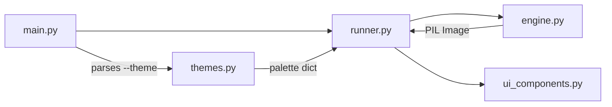

### Data Flow

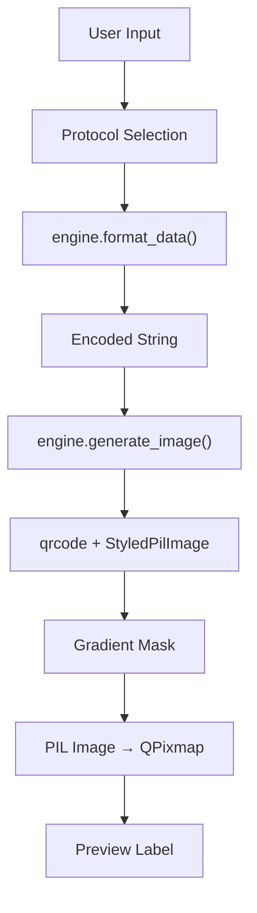

### Component Hierarchy

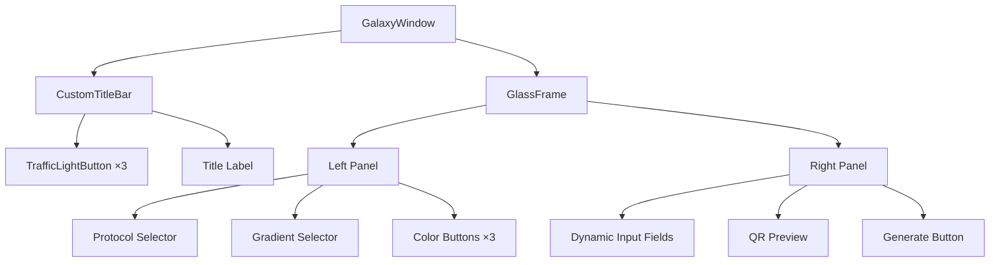

---

## 🎨 Themes

<div align="center">

| Theme | Background | Accent | Style |
|:------|:-----------|:-------|:------|
| `apple-dark` | `#121219` | Green → Blue | Clean default |
| `dracula` | `#282a36` | `#bd93f9` | Purple tones |
| `neon-cyber` | `#000000` | Magenta → Cyan | High contrast |
| `solarized` | `#002b36` | `#268bd2` | Easy on eyes |
| `ocean` | `#0f172a` | `#0ea5e9` | Cool blues |
| `matrix` | `#0d0208` | `#00ff41` | Terminal green |
| `synthwave` | `#2b213a` | Pink → Orange | Retro |
| `monokai` | `#272822` | `#f92672` | Editor classic |
| `nord` | `#2e3440` | `#88c0d0` | Scandinavian |
| `crimson` | `#110000` | `#cc0000` | Dark red |

</div>

> 💡 Want to add your own? See the [Contributing Guide](CONTRIBUTING.md#-adding-a-new-theme).

---

## 📘 Engineering Learnings

Scaling this UI engine into a deployable desktop suite provided rigorous technical exposure:

- **Cross-Platform Compilation:** Mastered PyInstaller payload structuring to guarantee execution isolation across Windows, macOS, and Linux ecosystems.
- **Declarative Theming:** Learned to bypass rigid GUI builder limitations by programmatically injecting dynamic stylesheets to execute real-time macOS glassmorphism effects.
- **CI/CD Lifecycle Construction:** Designed and automated production-grade GitHub action pipelines to handle static code analysis, matrix smoke testing, and artifact deployment.
- **Modular Desktop Engineering:** Migrated away from monolithic procedural scripts and successfully implemented strict model-view-controller separation inside the PyQt application lifecycle.

---

## 🚀 Quick Start

<details>
<summary><strong>🪟 Windows</strong></summary>

```powershell
git clone https://github.com/RajTewari01/galaxy-qr-generator.git
cd galaxy-qr-generator

python -m venv venv
venv\Scripts\activate

pip install -r requirements.txt

# Launch with default theme
python src/main.py

# Launch with a specific theme
python src/main.py --theme dracula
```

</details>

<details>
<summary><strong>🍎 macOS</strong></summary>

```bash
git clone https://github.com/RajTewari01/galaxy-qr-generator.git
cd galaxy-qr-generator

python3 -m venv venv
source venv/bin/activate

pip install -r requirements.txt

# Launch with default theme
python src/main.py

# Launch with a specific theme
python src/main.py --theme synthwave
```

</details>

<details>
<summary><strong>🐧 Linux (Debian / Ubuntu)</strong></summary>

```bash
git clone https://github.com/RajTewari01/galaxy-qr-generator.git
cd galaxy-qr-generator

sudo apt-get update && sudo apt-get install -y python3-venv libgl1

python3 -m venv venv
source venv/bin/activate

pip install -r requirements.txt

# Launch with default theme
python src/main.py

# Launch with a specific theme
python src/main.py --theme matrix
```

</details>

---

## 📦 Building Executables

<details>
<summary><strong>🪟 Windows — produces <code>dist\GalaxyQR.exe</code></strong></summary>

```powershell
venv\Scripts\activate
pip install pyinstaller
pyinstaller UltimateQR.spec
```

</details>

<details>
<summary><strong>🍎 macOS — produces <code>dist/GalaxyQR.app</code></strong></summary>

```bash
source venv/bin/activate
pip install pyinstaller
pyinstaller UltimateQR.spec
```

</details>

<details>
<summary><strong>🐧 Linux — produces <code>dist/GalaxyQR</code></strong></summary>

```bash
source venv/bin/activate
pip install pyinstaller
pyinstaller UltimateQR.spec
```

</details>

> 🤖 The [CI pipeline](.github/workflows/build.yml) builds all three platforms on every push. Tag a version (`v1.x.x`) to trigger the [Release pipeline](.github/workflows/release.yml) which publishes binaries to [GitHub Releases](https://github.com/RajTewari01/galaxy-qr-generator/releases).

---

## 🔌 Supported Protocols

<div align="center">

| Protocol | Output Format | Example Use |
|:---------|:-------------|:------------|
| **Website/URL** | `https://...` | Portfolio, product pages |
| **Wi-Fi** | `WIFI:S:...;T:...;P:...;;` | Guest network sharing |
| **Plain Text** | Raw string | Notes, messages |
| **vCard** | Contact VCF | Business cards |
| **SMS** | `SMSTO:number:text` | Marketing opt-ins |
| **Email** | `mailto:...` | Newsletter signups |
| **WhatsApp** | `wa.me/...` | Business inquiries |
| **YouTube** | Video URL | Content sharing |
| **UPI** | `upi://pay?...` | Indian digital payments |
| **Geo** | `geo:lat,long` | Location pins |

</div>

---

## ⚠️ Known Limitations

While extremely stable for isolated desktop generation, the following architectural constraints exist:

- **Platform Scope:** The interface is engineered exclusively for desktop bounds and contains no responsive scaling for mobile touch interfaces.
- **Scanner Edge Cases:** Deploying highly intricate, low-contrast multi-color radial gradients over very dense modules may interfere with outdated optical smartphone scanners.
- **Output Paradigms:** Application exclusively handles rasterized graphic outputs (`.png`, `.jpg`). Native SVG geometric vector export logic is not yet implemented.

---

## ⌨️ CLI Reference

```text
usage: main.py [-h] [--theme THEME]

options:
  -h, --help     show this help message and exit
  --theme THEME  Select UI theme (default: apple-dark)

choices: apple-dark, dracula, neon-cyber, solarized, ocean,
         matrix, synthwave, monokai, nord, crimson
```

---

## 📚 Dependencies

| Package | Version | Role |
|:--------|:--------|:-----|
| `PyQt5` | ≥ 5.15.2 | GUI framework |
| `qrcode[pil]` | ≥ 7.3 | QR generation engine |
| `Pillow` | ≥ 9.0 | Image processing |
| `BlurWindow` | ≥ 1.2.1 | Window blur effects |
| `pyinstaller` | ≥ 6.0 | Executable packaging |

---

## 🧪 Testing Strategy

Quality assurance relies on a highly automated verification layer, prioritizing integration stability over singular unit fragmentation:

- **Automated Smoke Initialization:** CI nodes verify complete application boot sequences across multi-os matrixes (Windows, Ubuntu, macOS).
- **Static Security Auditing:** AST-level vulnerability detection is strictly enforced by CodeQL on all inbound PRs.
- **Future Integration:** Plans include introducing snapshot pixel-rendering verifications and direct mock unit tests over the isolated generation engine.

---

## 🔬 CI/CD Pipeline

This project uses **6 automated GitHub Actions workflows**:

| Workflow | Trigger | Purpose |
|:---------|:--------|:--------|
| [🔬 CI Pipeline](.github/workflows/build.yml) | Push / PR to `main` | Lint → Smoke Test → Cross-platform Build |
| [🚀 Release](.github/workflows/release.yml) | `v*` tags | Build + Publish GitHub Release with binaries |
| [🛡️ CodeQL](.github/workflows/codeql.yml) | Push + Weekly | Security vulnerability scanning |
| [📖 Docs Quality](.github/workflows/docs.yml) | `.md` changes | Markdown lint + Link validation |
| [📦 Dependency Review](.github/workflows/dependency-review.yml) | PRs | Audit new dependencies for vulnerabilities |
| [🧹 Stale Cleanup](.github/workflows/stale.yml) | Daily | Auto-close inactive issues & PRs |

---

## 🤝 Contributing

We welcome contributions! Please read our [Contributing Guide](CONTRIBUTING.md) for:

- Development setup
- Code style & architecture rules
- How to add themes and protocols
- PR process & review expectations

---

## 🛡️ Security

Found a vulnerability? Please see our [Security Policy](SECURITY.md) for responsible disclosure guidelines.

---

## 📖 Wiki

For detailed documentation, visit the [Galaxy QR Core Wiki](https://github.com/RajTewari01/galaxy-qr-generator/wiki):

- [🏠 Home](https://github.com/RajTewari01/galaxy-qr-generator/wiki) — Overview & quick links
- [📥 Installation](https://github.com/RajTewari01/galaxy-qr-generator/wiki/Installation) — Platform-specific setup
- [🎨 Themes](https://github.com/RajTewari01/galaxy-qr-generator/wiki/Themes) — Deep dive into all 10 themes
- [🔌 Protocols](https://github.com/RajTewari01/galaxy-qr-generator/wiki/Protocols) — Protocol format specifications
- [🏗️ Architecture](https://github.com/RajTewari01/galaxy-qr-generator/wiki/Architecture) — Module design & data flow
- [❓ FAQ](https://github.com/RajTewari01/galaxy-qr-generator/wiki/FAQ) — Common issues & solutions

---

## 📄 License

[MIT](LICENSE) — Biswadeep Tewari, 2024–2026.

---

<div align="center">

**Built by [Biswadeep Tewari](https://github.com/RajTewari01)** · [tewari765@gmail.com](mailto:tewari765@gmail.com)

⭐ Star this repo if you find it useful!


</div>
