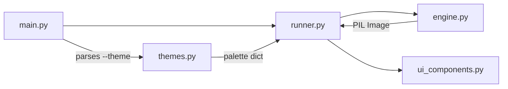
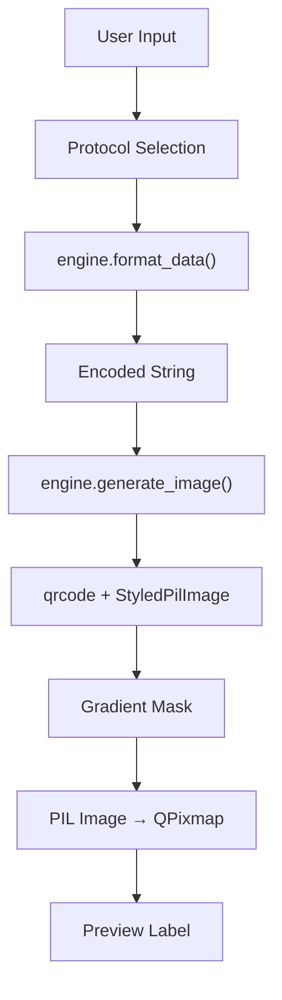
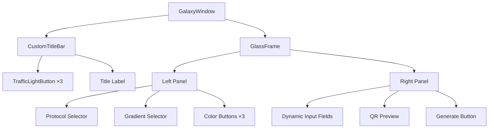

<div align="center">


[](https://python.org)
[](https://pypi.org/project/PyQt5/)
[](LICENSE)
[](.github/workflows/build.yml)

<br/><br/>


</div>

---

## Overview

Galaxy QR Core is a desktop application that generates styled QR codes with gradient color masks and rounded modules. It ships with **10 UI themes**, **10 data protocols**, and **4 gradient types** — all running 100% offline with zero network calls.

---

## Architecture

The codebase is structured as a layered pipeline. Each module owns a single concern.

```
src/
├── main.py            # Entrypoint — CLI args, QApplication bootstrap
├── themes.py          # Theme registry — 10 palettes as config dicts
├── engine.py          # Core logic — protocol formatting + QR generation
├── ui_components.py   # Shared widgets — title bar, glass frame, buttons
└── runner.py          # Application window — wires engine ↔ UI ↔ themes
```

### Module Dependencies



### Data Flow



### Component Hierarchy



---

## Themes

<div align="center">

| Theme | Background | Accent | Style |
|:------|:-----------|:-------|:------|
| `apple-dark` | `#121219` | Green → Blue | Clean default |
| `dracula` | `#282a36` | `#bd93f9` | Purple tones |
| `neon-cyber` | `#000000` | Magenta → Cyan | High contrast |
| `solarized` | `#002b36` | `#268bd2` | Easy on eyes |
| `ocean` | `#0f172a` | `#0ea5e9` | Cool blues |
| `matrix` | `#0d0208` | `#00ff41` | Terminal green |
| `synthwave` | `#2b213a` | Pink → Orange | Retro |
| `monokai` | `#272822` | `#f92672` | Editor classic |
| `nord` | `#2e3440` | `#88c0d0` | Scandinavian |
| `crimson` | `#110000` | `#cc0000` | Dark red |

</div>

---

## Quick Start

<details>
<summary><strong>🪟 Windows</strong></summary>

```powershell
git clone https://github.com/RajTewari01/galaxy-qr-generator.git
cd galaxy-qr-generator

python -m venv venv
venv\Scripts\activate

pip install -r requirements.txt

# Launch with default theme
python src/main.py

# Launch with a specific theme
python src/main.py --theme dracula
```

</details>

<details>
<summary><strong>🍎 macOS</strong></summary>

```bash
git clone https://github.com/RajTewari01/galaxy-qr-generator.git
cd galaxy-qr-generator

python3 -m venv venv
source venv/bin/activate

pip install -r requirements.txt

# Launch with default theme
python src/main.py

# Launch with a specific theme
python src/main.py --theme synthwave
```

</details>

<details>
<summary><strong>🐧 Linux (Debian / Ubuntu)</strong></summary>

```bash
git clone https://github.com/RajTewari01/galaxy-qr-generator.git
cd galaxy-qr-generator

sudo apt-get update && sudo apt-get install -y python3-venv python3-pyqt5 libgl1-mesa-glx

python3 -m venv venv
source venv/bin/activate

pip install -r requirements.txt

# Launch with default theme
python src/main.py

# Launch with a specific theme
python src/main.py --theme matrix
```

</details>

---

## Building Executables

<details>
<summary><strong>🪟 Windows — produces <code>dist\GalaxyQR.exe</code></strong></summary>

```powershell
venv\Scripts\activate
pip install pyinstaller
pyinstaller UltimateQR.spec
```

</details>

<details>
<summary><strong>🍎 macOS — produces <code>dist/GalaxyQR.app</code></strong></summary>

```bash
source venv/bin/activate
pip install pyinstaller
pyinstaller UltimateQR.spec
```

</details>

<details>
<summary><strong>🐧 Linux — produces <code>dist/GalaxyQR</code></strong></summary>

```bash
source venv/bin/activate
pip install pyinstaller
pyinstaller UltimateQR.spec
```

</details>

> The CI pipeline (`.github/workflows/build.yml`) builds all three platforms automatically on push. Artifacts are retained for 7 days.

---

## Supported Protocols

<div align="center">

| Protocol | Output Format | Example Use |
|:---------|:-------------|:------------|
| **Website/URL** | `https://...` | Portfolio, product pages |
| **Wi-Fi** | `WIFI:S:...;T:...;P:...;;` | Guest network sharing |
| **Plain Text** | Raw string | Notes, messages |
| **vCard** | Contact VCF | Business cards |
| **SMS** | `SMSTO:number:text` | Marketing opt-ins |
| **Email** | `mailto:...` | Newsletter signups |
| **WhatsApp** | `wa.me/...` | Business inquiries |
| **YouTube** | Video URL | Content sharing |
| **UPI** | `upi://pay?...` | Indian digital payments |
| **Geo** | `geo:lat,long` | Location pins |

</div>

---

## CLI Reference

```
usage: main.py [-h] [--theme THEME]

options:
  -h, --help     show this help message and exit
  --theme THEME  Select UI theme (default: apple-dark)

choices: apple-dark, dracula, neon-cyber, solarized, ocean,
         matrix, synthwave, monokai, nord, crimson
```

---

## Dependencies

| Package | Version | Role |
|:--------|:--------|:-----|
| `PyQt5` | ≥ 5.15.2 | GUI framework |
| `qrcode[pil]` | ≥ 7.3 | QR generation engine |
| `Pillow` | ≥ 9.0 | Image processing |
| `pyinstaller` | ≥ 6.0 | Executable packaging |

---

## Contributing

1. Fork → `git checkout -b feature/your-feature`
2. Commit → `git commit -m "Add feature"`
3. Push → `git push origin feature/your-feature`
4. Open a Pull Request

New features go into the appropriate pipeline module. Keep concerns separated.

---

## License

[MIT](LICENSE) — Biswadeep Tewari, 2024–2026.

---

<div align="center">

**Built by [Biswadeep Tewari](https://github.com/RajTewari01)** · [tewari765@gmail.com](mailto:tewari765@gmail.com)


</div>
