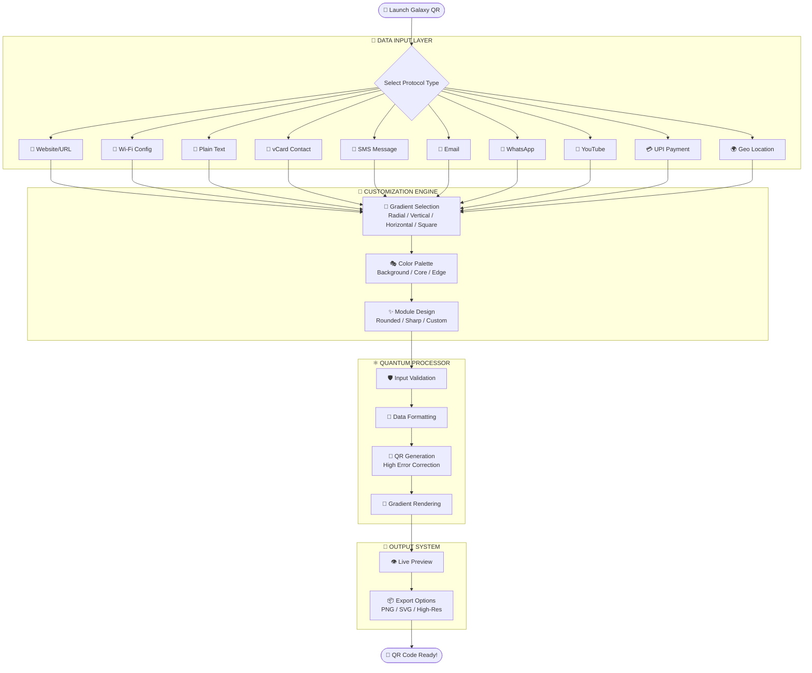
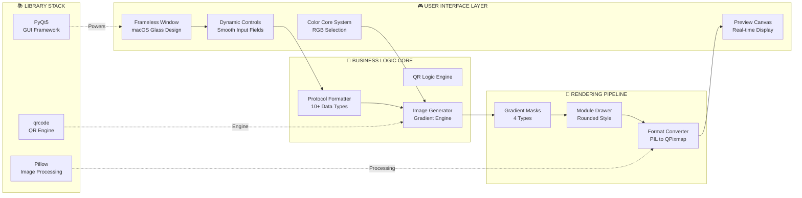

<div align="center">

# 🌌 GALAXY QR CORE 🌌


### ✨ *Cinematic Gradient QR Codes Powered by Space-Age Technology* ✨

[](https://python.org)
[](https://pypi.org/project/PyQt5/)
[](LICENSE)
[]()

[🚀 Quick Start](#-quick-start) • [✨ Features](#-features) • [📡 Protocols](#-supported-protocols) • [🤝 Contribute](#-contribute)

*Introducing an all-new professional architecture with an Apple-style Frameless Glassmorphism UI.*

</div>

---

<div align="center">

</div>

## 🎬 The Core Experience

Delivering top-grade QR codes with cinematic gradients in a beautifully designed framework. Developed for both modern aesthetic appeal and offline productivity. Whether you need a simple vCard or automated Geo-Coordinates padding, the Quantum Processor handles it gracefully.

---

## 🎬 Application Workflow

<div align="center">

</div>



---

## 🏗️ System Architecture

<div align="center">

</div>



---

## ✨ Enterprise-Grade Features

<table>
<tr>
<td width="50%" valign="top">

### 🎨 Apple-Style Aesthetics
- **Frameless Custom UI**: An authentic macOS-style traffic light window control system (Close, Min, Max).
- **Deep Glassmorphism**: Translucent panels with deep shadows mimicking Apple's Acrylic blurs.
- **Micro-Animations**: Clean hover states, button-press physics, and elegant form inputs.
- **Refined Typography**: Native system fonts tuned for maximum readability and a premium layout.

</td>
<td width="50%" valign="top">

### 🔒 100% Secure & Offline
- **Zero Telemetry**: Fully local, completely air-gapped processing engine.
- **No Cloud Uploads**: We don’t harvest your contact cards or API payloads.
- **Rapid Edge Compute**: Runs completely efficiently using CPU optimizations.
- **GDPR Compliant**: Inherently safe by processing nothing remotely.
</td>
</tr>
<tr>
<td width="50%" valign="top">

### 🎭 Quantum Gradients
- **Four Dimensional Patterns**: Support for `Radial`, `Vertical`, `Horizontal`, and `Square` gradient flows.
- **Tri-Color Mixing Environment**: Pick your deep Background layer, absolute Core color, and vibrating Edge color.
- **Real-Time Preview**: An internal rendering window updates the quantum map dynamically.

</td>
<td width="50%" valign="top">

### ⚡ Smart Execution
- **High Error-Correction**: Defaults to `ERROR_CORRECT_H` ensuring scannability even with complex gradients.
- **Format Intelligence**: Extracts specific strings to form proper WhatsApp URIs or SMS templates.
- **Crash Prevention Layer**: Checks for empty modules, null inputs, and unexpected exceptions instantly.

</td>
</tr>
</table>

---

## 📡 Supported Protocols

<div align="center">

```text
╔══════════════════════════════════════════════════════════════════════╗
║                     10+ PROTOCOL SUPPORT MATRIX                      ║
╚══════════════════════════════════════════════════════════════════════╝
```

| Icon | Protocol | Output Format | Ideal Use Case |
|:----:|:---------|:--------------|:---------------|
| 🔗 | **Website/URL** | `https://domain.com` | Standard links, portfolios, products. |
| 📶 | **Wi-Fi** | `WIFI:S:SSID;T:WPA;P:password;;` | Hospitality, cafes, guest networks. |
| 👤 | **vCard** | Contact VCF data | Business cards, digital networking. |
| 💬 | **SMS** | `SMSTO:number:text` | Marketing opt-ins, quick texting. |
| 📱 | **WhatsApp** | `wa.me/number?text=msg` | Business inquiries, fast chats. |
| 💳 | **UPI** | `upi://pay?pa=id&pn=name` | Seamless Indian digital payments. |
| 🌍 | **Geo Location**| `geo:lat,long` | Google Maps drop pins, tracking. |
| 📝 | **Email & Text**| Standard text logic | Newsletters, basic memos. |

</div>

---

## 🚀 Quick Start & Installation

### 📋 Prerequisites
- **Python:** `3.10+` recommended
- **OS:** Windows 10/11, macOS, Linux
- **Memory:** Lightweight (~50 MB RAM active footprint)

### 🔧 Developer Setup

The most effective way to engage with the Galaxy QR Core is via a secure virtual environment.

```bash
# 1. Clone the repository into local space
git clone https://github.com/RajTewari01/QR_CODE_GENERATOR_WITH_EXE.git
cd QR_CODE_GENERATOR_WITH_EXE

# 2. Deploy a new Quantum Space (Virtual Environment)
python -m venv qr

# 3. Activate the Environment
# ➡️ On Windows:
qr\Scripts\activate
# ➡️ On macOS/Linux:
source qr/bin/activate

# 4. Integrate core dependencies
pip install -r requirements.txt

# 5. Ignite the UI
python src/qr.py
```

### 🔨 Build Standalone Executables

For automated deployment, use the newly integrated PyInstaller `.spec` build logic or the GitHub Actions CI pipeline.

```bash
# Ensure PyInstaller is strictly installed
pip install pyinstaller

# Run the complex build pipeline specifically tailored for Galaxy QR
pyinstaller UltimateQR.spec
```
_All fully processed binaries will be safely deposited inside the local `dist/` directory, optimized for your host OS._

---

## 📂 Internal Project Logistics

```text
QR_CODE_GENERATOR_WITH_EXE/
├── src/
│   └── qr.py                  # 🚀 The Core Application Engine & Logic
├── assets/                    # 🎨 Project Media & Iconography
├── .github/workflows/         # 🤖 Automated cross-platform GitHub CI builds
│   └── build.yml
├── requirements.txt           # 📦 Primary Dependencies List
├── UltimateQR.spec            # 🔨 Advanced PyInstaller Specifications
├── LICENSE                    # 📜 Full Detailed Open Source License
└── README.md                  # 📖 Internal Documentation Manifest
```

---

## 🤝 Contribute to the Galaxy

We consistently welcome advanced Pull Requests and feature additions to the engine!

1. Fork the framework and enter your local module (`git checkout -b feature/star-cluster`)
2. Commit your enhanced architecture (`git commit -m "✨ Deployed highly advanced feature"`)
3. Open a Pull Request! Great discoveries are always merged gracefully.

---

## 👨‍💻 Primary Architect

<div align="center">

### **Biswadeep Tewari**
*Software Engineer • Architecting the Cosmos Locally.*

[](https://github.com/RajTewari01)
[](mailto:tewari765@gmail.com)

**Made with 💜 and ☕**


</div>
